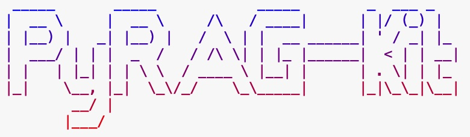

<div align="center">



</div>

<div align="center">

[](https://www.python.org/)
[](https://opensource.org/licenses/MIT)
[](mailto:1360962086@qq.com)

</div>

> **PyRAG-Kit** 是一个 **Dify 核心逻辑的 Python 实现**，旨在提供一个轻量级的本地化工具，用于快速验证和理解 Dify 的知识库核心工作流程，包括文档的**向量化、分段处理**以及**混合检索**策略。

---

## ✨ 核心功能

- **🔌 多模型支持**: 无缝集成多种主流和本地大语言模型，包括 Google Gemini, OpenAI GPT, Anthropic Claude, 阿里云通义千问, 豆包, DeepSeek, Grok, 以及通过 Ollama 或 LM Studio 运行的本地模型。
- **🚀 高级检索策略**: 支持向量检索、全文检索和混合检索，并通过 Rerank 模型二次精排，提升答案相关性。
- **⚙️ 动态交互配置**: 运行时通过 `/config` 命令打开交互式菜单，动态切换LLM、调整检索策略、修改权重等。
- **📄 流式响应**: 客服回答采用打字机流式输出，提升用户交互体验。
- **📊 统一日志系统**: 采用标准 `logging` 模块，将程序运行和聊天对话的详细信息统一记录到文件和控制台，便于审计、分析和调试。
- **✅ 单元测试**: 为核心模块（如模型提供商工厂、向量存储工厂、ETL流水线）编写了全面的单元测试，确保代码质量和功能稳定性。
- **🧹 智能缓存与清理**: 自动处理知识库向量化，并在程序退出时清理缓存，保持项目整洁。

## 📸 程序截图


## 📂 项目结构

项目采用了现代化的目录结构，将源代码、数据、脚本和文档清晰地分离开来。

```
.
├── data/                # 生成的数据 (被 .gitignore 忽略)
│   ├── employee_kb.pkl  # 知识库向量文件
│   └── logs/            # 聊天日志
├── knowledge_base/      # 存放你的原始知识库 .md 文件
├── scripts/             # 独立脚本
│   └── embed_knowledge_base.py # 知识库向量化脚本
├── src/                 # 核心源代码
│   ├── chat/            # 聊天核心逻辑
│   ├── providers/       # 所有模型提供商的实现
│   ├── retrieval/       # 检索逻辑
│   ├── ui/              # 用户界面 (菜单、显示工具)
│   └── utils/           # 辅助工具 (配置、清理、日志管理)
├── tests/               # 自动化测试
│   ├── etl/             # ETL流水线测试
│   ├── providers/       # 模型提供商测试
│   └── retrieval/       # 检索模块测试
├── main.py              # 程序主入口
├── config.ini.example   # 配置文件模板
├── .gitignore           # Git忽略文件配置
├── README.md            # 就是你正在看的这个文件
└── requirements.txt     # Python依赖项
```

## 🚀 安装与运行

### 1. 克隆项目

```bash
git clone https://github.com/MisonL/PyRAG-Kit.git
cd PyRAG-Kit
```

### 2. 安装依赖

项目使用 `requirements.txt` 管理依赖。

```bash
pip install -r requirements.txt
```

### 3. 配置指南

本项目采用了一套灵活的分层配置系统。您可以根据自己的喜好和使用场景，选择以下任何一种或多种方式进行配置。

**配置加载优先级:**

系统会按照以下顺序寻找配置项，排在前面的方式会覆盖排在后面的：

1.  **环境变量** (最高优先级)
2.  **`.env` 文件** (位于项目根目录)
3.  **`config.ini` 文件** (位于项目根目录)
4.  **代码中的默认值** (最低优先级)

---

#### **方式一: `config.ini` 文件 (推荐用于本地开发)**

这是最直观的配置方式。

1.  **创建配置文件**:
    ```bash
    cp config.ini.example config.ini
    ```

2.  **编辑 `config.ini`**:
    打开 `config.ini` 文件，根据您的需求修改。文件内有详细的中文注释说明每个配置项的作用。
    ```ini
    # config.ini

    [API_KEYS]
    # 填入你希望使用的模型的API Key
    GOOGLE_API_KEY = "AIzaSy..."
    # ...

    [BEHAVIOR]
    # 默认使用的LLM提供商
    DEFAULT_LLM_PROVIDER = google
    # ...
    ```

---

#### **方式二: `.env` 文件 (推荐用于隔离敏感信息)**

您可以将敏感信息（如API密钥）或需要频繁更改的配置放在 `.env` 文件中，这个文件通常不提交到版本控制系统。

1.  在项目根目录创建一个名为 `.env` 的文件。

2.  在文件中以 `KEY=VALUE` 的格式添加配置项。注意，这里的键名需要与 `config.ini` 中的键名保持一致，但不需要段落 `[SECTION]`。
    ```dotenv
    # .env
    # 这里的配置会覆盖 config.ini 中的同名配置

    OPENAI_API_KEY="sk-your-real-openai-key"
    DEFAULT_LLM_PROVIDER="openai-gpt4o"
    LOG_LEVEL="DEBUG"
    ```

---

#### **方式三: 环境变量 (推荐用于生产部署)**

在服务器或 Docker 环境中部署时，使用环境变量是最标准、最安全的方式。

-   在 Linux 或 macOS 系统中:
    ```bash
    export OPENAI_API_KEY="sk-your-real-openai-key"
    export DEFAULT_LLM_PROVIDER="openai-gpt4o"
    python main.py
    ```
-   在 Windows (PowerShell) 中:
    ```powershell
    $env:OPENAI_API_KEY="sk-your-real-openai-key"
    $env:DEFAULT_LLM_PROVIDER="openai-gpt4o"
    python main.py
    ```

> **总结**:
> - **本地开发**: 直接修改 `config.ini` 最方便。
> - **团队协作**: 使用 `config.ini` 作为基础配置，个人使用 `.env` 文件覆盖部分配置（并将 `.env` 加入 `.gitignore`）。
> - **服务器部署**: 使用环境变量来管理所有配置，特别是密钥。

### 4. 准备知识库

将你的 `.md` 格式的知识库文档放入 `knowledge_base` 文件夹中。

### 5. 运行程序

直接从项目根目录运行主程序文件即可。

```bash
python main.py
```

**程序会自动完成以下工作:**
1.  **检查知识库**: 如果 `knowledge_base` 目录中有新的或更新的文档，程序会自动进行向量化并更新 `data/employee_kb.pkl` 文件。
2.  **启动聊天**: 直接进入交互式聊天会话。

**常用命令:**
-   输入 `/config` 可以随时打开动态配置菜单。
-   输入 `/quit` 或 `exit` 可以退出聊天。
-   详细日志请查看 `data/logs/` 目录下的文件。

---

<div align="center">

## ⚖️ 许可证声明

本项目移植了部分 [Dify](https://github.com/langgenius/dify) 的核心逻辑。Dify 采用的是 [Apache License 2.0](http://www.apache.org/licenses/LICENSE-2.0) 的修改版本，并附加了特定的商业使用条件（例如多租户服务和前端 LOGO/版权限制）。

因此，本项目在使用 Dify 源码的部分，也需遵循 Dify 的原始许可证及其附加条件。详细许可证内容请参阅项目根目录下的 [`DIFY_LICENSE`](DIFY_LICENSE) 文件。

在遵守 Dify 许可证的前提下，本项目其余部分采用 [MIT License](https://opensource.org/licenses/MIT) 进行许可。

### Dify 移植代码文件

以下文件包含或受 Dify 核心逻辑启发：

*   `src/etl/pipeline.py`
*   `src/etl/cleaners/base.py`
*   `src/etl/cleaners/basic_cleaner.py`
*   `src/etl/extractors/base.py`
*   `src/etl/extractors/markdown_extractor.py`
*   `src/etl/splitters/base.py`
*   `src/etl/splitters/recursive_text_splitter.py`
*   `src/retrieval/retriever.py`
*   `src/retrieval/vdb/base.py`
*   `src/retrieval/vdb/factory.py`
*   `src/retrieval/vdb/faiss_store.py`
*   `src/models/document.py`

</div>
