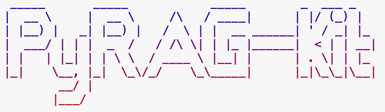

<div align="center">


# PyRAG-Kit

**轻量级、面向架构验证的 Dify 核心逻辑 Python 实现**

[](https://www.python.org/)
[](DIFY_LICENSE)
[](https://github.com/astral-sh/uv)

</div>

---

## 📌 项目定位

**PyRAG-Kit** 是对 [Dify](https://github.com/langgenius/dify) 核心 RAG (Retrieval-Augmented Generation) 逻辑的深度剖析与 Python 原生实现。本项目并非 Dify 的简单克隆，而是旨在提供一个**高透明度、高性能且可快速迭代的本地化实验场**，用于验证和研究：

- **全链路异步流水线**: 从文档 ETL 到混合检索及 LLM 生成的全过程异步化。
- **高维索引平衡**: 哈希/向量检索与传统关键词检索的混合策略及加权融合。
- **Provider 解耦架构**: 针对主流模型供应商（Google, OpenAI, Anthropic 等）的标准化抽象与容错处理。
- **工程化最佳实践**: 采用 `uv` 环境管理、CSE 性能传感器及 `tenacity` 指数退避重试机制。

---

## ✨ 核心能力

- **🏗️ 异步 RAG 架构**: 基于 `asyncio` 构建的非阻塞检索流水线，支持高并发处理与流式响应输出。
- **🔌 模块化扩展 (`ProviderFactory`)**: 无缝集成 Google Gemini (采用最新 `google-genai` SDK)、OpenAI GPT-4o、Anthropic Claude 3.5、DeepSeek 以及国产闭源/开源模型（豆包、通义千问等）。
- **🚀 混合检索策略 (Hybrid Search)**: 深度复现 Dify 混合检索逻辑，支持语义向量检索、全文检索（BM25）及其加权分值融合。
- **🎯 语义精排 (Rerank)**: 支持集成 Jina AI、SiliconFlow 等 Rerank 模型，对海量召回结果进行二次精排，解决 RAG 系统中的“召回精度不足”问题。
- **🧱 本地可复现默认链路**: 默认使用 `local-hash` 嵌入模型，本地无需额外 Embedding API 即可完成知识库构建、召回测试和聊天验证。
- **⚙️ 交互式配置控制**: 通过 `/config` 命令在运行时动态调整全局参数，包括检索 Top-K、权重配比及重试策略。
- **🧪 架构级验证工具**: 内置 `AGENTS.md` 指导原则与全面的 `pytest` 测试套件，确保每一行核心逻辑的可重复性验证。

---

## 📂 目录结构

```text
.
├── src/
│   ├── chat/           # 会话控制中心：响应流管理与 RAG 循环逻辑
│   ├── providers/      # 供应商适配层：标准化 SDK 调用与异常隔离
│   ├── retrieval/      # 检索引擎：向量存储与混合搜索算法
│   ├── etl/            # 数据管道：文档结构化、清洗与分块向量化
│   ├── ui/             # 交互界面：动态配置菜单与 Rich 渲染
│   └── utils/          # 基础设施：强类型配置 (Pydantic) 与日志系统
├── scripts/            # 工具脚本：大规模知识库离线构建
├── tests/              # 验证矩阵：覆盖核心组件的单元测试
└── data/               # 持久化层：向量索引文件与审计日志
```

---

## 快速开始

### 1. 环境初始化

本项目推荐使用 [uv](https://github.com/astral-sh/uv) 进行高性能依赖管理。

```bash
git clone https://github.com/MisonL/PyRAG-Kit.git
cd PyRAG-Kit

# 同步依赖并初始化虚拟环境 (Python 3.11+)
uv sync
```

### 2. 配置与认证

PyRAG-Kit 采用分层配置策略（环境变量 > `.env` > `config.toml` > 代码默认值）。

```bash
# 从模板创建本地主配置文件和密钥文件
cp config.toml.example config.toml
cp .env.example .env
```

说明：
1. `config.toml.example` 会纳入版本控制，`config.toml` 仅作本地配置，不应提交。
2. 默认嵌入模型是 `local-hash`，首次向量化不需要额外的 Embedding API Key。

编辑 `config.toml`：
1. 在根级字段中调整默认路径、检索参数和 base url。
2. 在 `[llm_configurations]`、`[embedding_configurations]`、`[rerank_configurations]` 下使用 TOML 表定义模型。

编辑 `.env`：
1. 只填写 API Key 等敏感信息。
2. 如需使用 OpenAI 兼容渠道，可覆盖 `OPENAI_API_BASE` 和 `DEFAULT_LLM_PROVIDER`。

### 3. 运行系统

1. 将原始 Markdown 文件放入 `knowledge_base/`。
2. 启动主程序：

```bash
uv run main.py
```

3. 在主菜单中按需执行：
   - `1`：重建知识快照
   - `2`：执行召回测试
   - `3`：启动聊天会话

也可以直接重建知识库：

```bash
uv run python -m scripts.embed_knowledge_base --mode standard
```

默认会生成一个新的知识快照目录，并更新活动快照指针：

```text
data/kb/ACTIVE_SNAPSHOT
data/kb/<snapshot_id>/
```

---

## 📖 开发者文档

- [用户指南](./docs/user_guide/introduction.md)
- [核心概念](./docs/user_guide/core-concepts.md)
- [开发者指南](./docs/developer_docs/developer-guide.md)
- [重构路线图](./docs/developer_docs/REFACTORING_PLAN.md)

---

## ⚖️ 商业许可与源代码声明

**PyRAG-Kit 包含 Dify 核心逻辑的衍生实现。**

- **Dify 移植板块**: 本项目在 `src/etl/` 和 `src/retrieval/` 等目录中使用了 Dify 核心代码。这些部分遵循 [Dify Modified Apache License 2.0](DIFY_LICENSE)。禁止通过此部分代码构建多租户商业服务，且必须保留原始作者版权。
- **项目框架层**: 本项目自身的工程化架构、Provider 适配层及测试链路采用 [MIT 许可证](LICENSE)。

详细移植列表与版权说明请参阅 [`AGENTS.md`](AGENTS.md)。

---
<div align="center">
Created by Mison @ 2025 | 基于 Dify 核心架构的本地化演进
</div>
