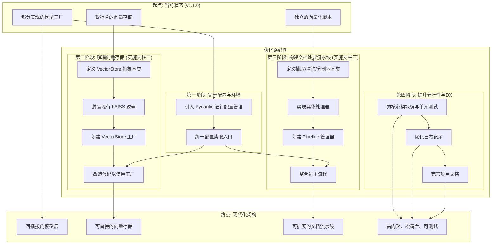

# PyRAG-Kit 重构与演进路线图

## 1. 愿景与目标

将本项目从一个功能验证原型，系统性地演进为一个 **“Dify核心逻辑的轻量级本地验证器”**。这意味着我们的架构需要与Dify官方源码中先进的、松耦合的设计思想对齐，实现一个高内聚、松耦合、可扩展、易于测试的现代化Python应用。

## 2. 当前状态评估 (截至 v1.1.0)

经过初步开发，项目已经取得了显著进展，特别是完成了重构蓝图中的关键一步：

*   **已完成**:
    *   **支柱一：模型管理系统** - 已成功引入工厂模式 (`ModelProviderFactory`)，实现了模型提供商的动态加载和实例化，这是一个巨大的胜利。

*   **待优化**:
    *   **向量存储强耦合**: 核心逻辑与FAISS及`pickle`文件格式紧密绑定。
    *   **文档处理流程固化**: 向量化过程被封装在独立的外部脚本中，不易扩展。
    *   **配置管理分散**: 采用传统的`.ini`文件，缺乏类型安全和结构化。
    *   **可测试性不足**: 缺乏单元测试，为未来的重构和迭代带来风险。

## 3. 优化计划：完成并深化重构蓝图

我们将继续遵循最初的重构蓝图，并在此基础上进行深化和完善，分阶段完成整个演进过程。

---

### 4. 实施阶段详解

#### 第一阶段：配置与环境现代化

*   **目标**: 统一并强化配置管理，为后续的工厂模式提供更可靠的配置源。
*   **核心任务**:
    1.  **引入 Pydantic**: 在`requirements.txt`中添加`pydantic`。
    2.  **创建配置模型**: 在`src/utils/config.py`中，使用Pydantic模型来定义强类型的配置结构，替代现有的`config.ini`分散读取方式。
    3.  **提供全局配置实例**: 提供一个全局可访问的、经过验证的配置对象。

#### 第二阶段：向量存储系统解耦 (实施重构支柱二)

*   **目标**: 解除对 FAISS 和 Pickle 的硬编码依赖，实现可插拔的向量数据库层。
*   **核心任务**:
    1.  **定义抽象基类**: 在 `src/retrieval/` 下创建 `vdb/` 目录，并在 `vdb/base.py` 中定义 `VectorStoreBase` 抽象类，包含 `add_documents()`, `search()`, `save()`, `load()` 等标准接口。
    2.  **封装FAISS实现**: 创建 `vdb/faiss_store.py`，实现 `FaissStore` 类，将当前与FAISS相关的逻辑全部封装进去。
    3.  **创建工厂**: 创建 `vdb/factory.py`，实现 `VectorStoreFactory`，根据配置返回一个具体的 `VectorStore` 实例。
    4.  **改造核心逻辑**: 重构 `Chatbot` 和 `embed_knowledge_base.py`，使其通过工厂获取向量存储实例，面向接口编程。

#### 第三阶段：构建文档处理流水线 (实施重构支柱三)

*   **目标**: 将固化的向量化脚本，改造成灵活、可扩展的数据处理流水线 (ETL)。
*   **核心任务**:
    1.  **创建ETL模块**: 在`src/`下创建`etl/`目录，用于存放所有数据处理逻辑。
    2.  **定义处理器基类**: 在`etl/`下创建`extractors`, `cleaners`, `splitters`子目录，并为每种处理器定义抽象基类。
    3.  **实现具体处理器**: 提供针对Markdown的抽取器、基础的文本清洗器和递归文本分割器的具体实现。
    4.  **创建流水线管理器**: 在`etl/pipeline.py`中创建一个`PipelineManager`，它可以根据文件类型和配置，动态地组合这些处理器来处理文档。
    5.  **整合**: 改造`main.py`中的向量化选项，使其调用`PipelineManager`来执行处理。

#### 第四阶段：提升健壮性与开发者体验 (DX)

*   **目标**: 为项目未来的健康发展和社区贡献奠定基础。
*   **核心任务**:
    1.  **编写单元测试**: 在 `tests/` 目录下，为新创建的工厂、Pydantic模型和核心组件编写单元测试。
    2.  **统一日志**: 审查并统一项目中的日志记录风格和格式，确保关键操作都有日志输出。
    3.  **更新文档**: 在所有重构完成后，更新 `README.md` 以反映最终的架构和使用方法。

## 5. 下一步行动

在您确认此计划后，我们将切换到“代码”模式，并从 **第一阶段：配置与环境现代化** 开始，逐步实施此路线图。